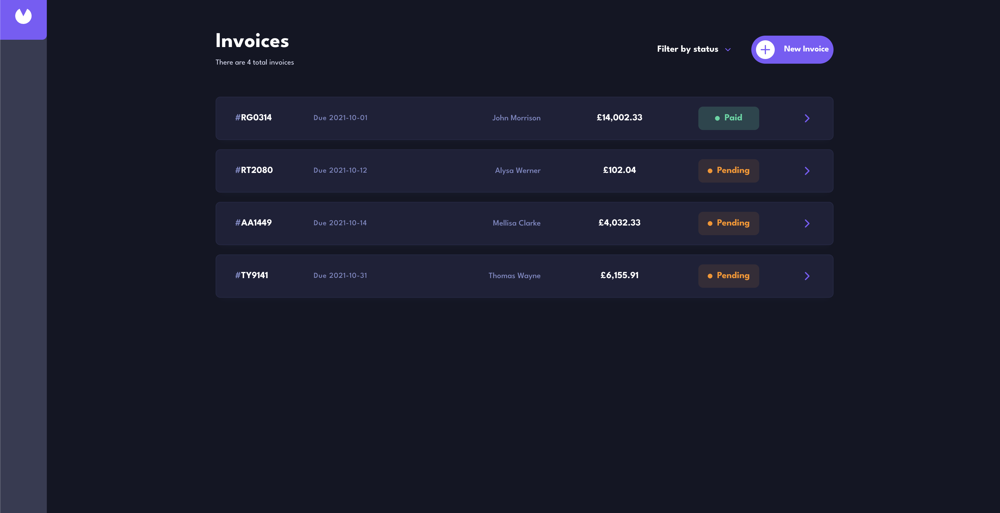

# Frontend Mentor - Invoice app solution

This is a solution to the [Invoice app challenge on Frontend Mentor](https://www.frontendmentor.io/challenges/invoice-app-i7KaLTQjl). Frontend Mentor challenges help you improve your coding skills by building realistic projects. 

## Table of contents

- [Overview](#overview)
  - [The challenge](#the-challenge)
  - [Screenshot](#screenshot)
  - [Links](#links)
- [My process](#my-process)
  - [Built with](#built-with)
  - [What I learned](#what-i-learned)
  - [Continued development](#continued-development)

- [Author](#author)

## Overview

### The challenge

Users should be able to:

- View the optimal layout for the app depending on their device's screen size
- See hover states for all interactive elements on the page
- Create, read, update, and delete invoices
- Receive form validations when trying to create/edit an invoice
- Save draft invoices, and mark pending invoices as paid
- Filter invoices by status (draft/pending/paid)
- Toggle light and dark mode

### Screenshot

### Links

- Solution URL: [GitHub Repo](https://github.com/alsheha88/invoice-app)
- Live Site URL: [Live Site](https://invoice-app-theta-flax.vercel.app/)

## My process

### Built with

- Semantic HTML5 markup
- CSS custom properties
- Flexbox
- CSS Grid
- Mobile-first workflow
- [React](https://reactjs.org/) - JS library
- [TypeScript](https://www.typescriptlang.org)
- [Next.js](https://nextjs.org/) - React framework
- [Prisma ORM](https://www.prisma.io/) - For Database
- [Tailwind](https://tailwindcss.com/) - For styles
- [react-lucide](https://lucide.dev/) - For icons

### What I learned

This is my second Next.js project, and the server/client boundary finally clicked.

Server Actions replaced the API routes I'd have written in a Vite + Express setup — mutations run on the server and call `revalidatePath` to refresh the affected pages, so there's no client-side cache to manage.

Interactive state (dialogs, filters) has to live in a client component, but the page itself stays a server component so it can fetch data directly. Putting a thin client wrapper between them kept the data-fetching on the server without making the whole tree client-side.

### Continued development

I want to keep building full-stack applications with Next.js and get comfortable with the parts I haven't touched yet — authentication, API routes, and more complex database relationships.

## Author
- Frontend Mentor - [@alsheha88](https://www.frontendmentor.io/profile/alsheha88)

